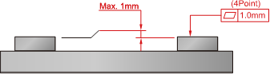

# 3.5.4. Accuracy of Installation Surface

The degree of flatness for the four attachment plate surfaces should satisfy the specification. Use a shim, if necessary. The rest of the surface must be flat within ±2mm.

*	Cautions

①	The flatness of the 4 mounting plates must be within 1.0 mm.

②	The flatness of the 4 areas of the plate for assembly must be within 1.0 mm (±0.5 mm).

Figure 3.11 Robot installation surface accuracy